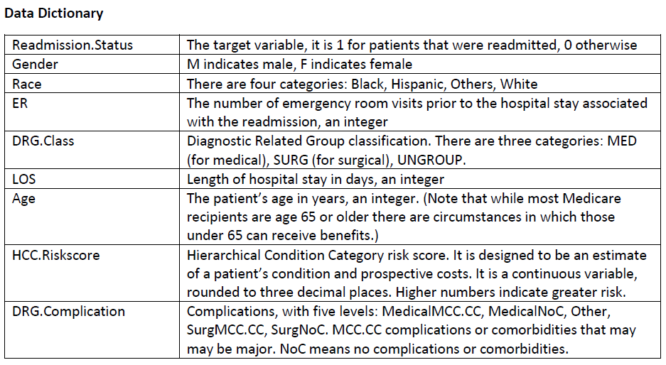

# Hospital Readmissions prediction

2019 SOA 資料分析試題

* 資料概述 : 醫院病患就診資訊
* 資料維度 : 66783 x 10 
* feature 
  

    | Readmission.Status | Gender | Race  | ER | DRG.Class | LOS | Age | HCC.Riskscore | DRG.Complication |
    |--------------------|--------|-------|----|-----------|-----|-----|---------------|------------------|
    | 1                  | M      | White | 0  | MED       | 29  | 73  | 12.307        | Other            |
    | 0                  | M      | White | 0  | SURG      | 5   | 73  | 12.307        | SurgNoC          |
    | 0                  | M      | White | 0  | SURG      | 9   | 73  | 12.307        | SurgNoC          |
    | 1                  | M      | White | 0  | MED       | 5   | 73  | 12.307        | MedicalNoC       |
    | 0                  | M      | White | 0  | MED       | 13  | 73  | 12.307        | MedicalNoC       |
    | 1                  | M      | White | 0  | SURG      | 10  | 73  | 12.307        | SurgMCC.CC       |
    | 0                  | F      | White | 0  | MED       | 4   | 71  | 11.372        | MedicalNoC       |
    | 1                  | F      | White | 1  | MED       | 10  | 71  | 11.372        | MedicalMCC.CC    |
    | 1                  | F      | White | 1  | MED       | 14  | 71  | 11.372        | MedicalMCC.CC    |
    | 1                  | F      | White | 1  | SURG      | 4   | 71  | 11.372        | SurgMCC.CC       |
    | 0                  | F      | White | 0  | SURG      | 3   | 71  | 11.372        | SurgNoC          |
    | 0                  | M      | White | 0  | MED       | 9   | 67  | 10.897        | MedicalMCC.CC    |
    | 0                  | M      | White | 0  | SURG      | 8   | 67  | 10.897        | SurgMCC.CC       |
    | 1                  | M      | White | 1  | MED       | 22  | 67  | 10.897        | MedicalNoC       |
    | 0                  | M      | White | 1  | MED       | 10  | 67  | 10.897        | Other            |
    | 1                  | M      | White | 0  | SURG      | 8   | 67  | 10.897        | SurgMCC.CC       |
    | 0                  | M      | White | 1  | MED       | 9   | 43  | 10.764        | MedicalNoC       |
